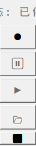

# 实时字幕保存工具 - 增强版

**厌倦了Windows实时字幕丢失？** 这是一个增强型工具，用于保存和管理实时字幕，功能更加强大！应用程序位于 `dist` 文件夹中，您也可以从发布页面下载。

## 🙏 致谢

这是 [M-T-Arden](https://github.com/M-T-Arden) 原始项目 [SaveLiveCaptions](https://github.com/M-T-Arden/SaveLiveCaptions) 的分支版本。感谢您创建了这款出色的工具！

## ✨ 增强功能

此版本包含对原始版本的重大改进：

### 🎯 核心功能
- **实时字幕捕获**：自动捕获Windows实时字幕
- **可拖拽界面**：最小化的浮动面板，可移动到任何位置
- **自定义保存位置**：选择字幕文件保存位置

### 🚀 新增增强功能
- **分段录制**：无需重启应用程序即可暂停和恢复录制
- **智能句子提取**：改进的文本处理，获得更好的句子边界
- **重复防护**：智能去重，避免重复内容
- **文件预览**：暂停期间直接从界面打开已保存的字幕
- **状态指示器**：当前录制状态的清晰视觉反馈
- **五按钮布局**：增强的直观控制界面

## 📖 使用指南

### 1. 开始使用
1. 启动前确保Windows实时字幕已**启用**
2. 双击 `SaveLiveCaptions.exe`
3. 浮动面板出现在屏幕左上角
4. 拖拽背景可将窗口移动到任何位置

### 2. 界面控制



增强界面包含5个功能清晰的按钮：

- **🔴 开始**（红色圆圈）：开始新的录制会话，创建新文件
- **⏸ 暂停**（橙色暂停）：暂停当前录制并启用文件预览
- **▶ 恢复**（绿色三角）：在同一文件中继续录制
- **📂 打开**（文件夹）：使用默认文本编辑器打开保存的字幕文件（仅在暂停时可用）
- **⬛ 退出**（黑色方块）：停止录制并关闭应用程序

### 3. 录制工作流程

**单次会话录制：**
1. 点击 **🔴 开始** 开始录制
2. 出现提示时选择保存位置
3. 完成后点击 **⬛ 退出**

**分段录制（新功能）：**
1. 点击 **🔴 开始** 开始录制
2. 需要休息时点击 **⏸ 暂停**
3. 点击 **📂 打开** 查看已捕获的内容
4. 点击 **▶ 恢复** 在同一文件中继续录制
5. 根据需要重复步骤2-4
6. 完全完成后点击 **⬛ 退出**

### 4. 文件管理

您的字幕保存为 `YYYY-MM-DD_HH-MM-SS_captions.txt` 格式，包含增强格式化：

```
[19:00:44] 我买了所有你喜欢的食物，亲爱的。
[19:00:45] ===== 录制暂停 =====
[19:01:15] ===== 录制继续 =====
[19:01:16] 非常感谢你。
```

**增强功能：**
- ✅ 每个片段的精确时间戳
- ✅ 清晰的暂停/恢复标记，便于导航
- ✅ 改进的句子分割
- ✅ 智能文本处理，减少片段
- ✅ 自动重复防护

### 5. 状态指示器

面板显示当前录制状态：
- **🔴 录制中**：正在积极捕获字幕
- **🟠 已暂停**：录制已暂停，文件预览可用
- **⚪ 已停止**：未在录制，准备开始


## 🔧 技术改进

- **增强文本处理**：更好的句子边界检测和清理
- **智能缓冲管理**：防止重复和碎片化内容
- **异步架构**：流畅性能，无界面冻结
- **改进错误处理**：更好的可靠性和优雅降级

## 📋 功能对比

| 功能 | 原版 | 增强版 |
|------|--------|----------|
| 录制 | 仅单次会话 | ✅ 分段录制 |
| 界面 | 2个基础按钮 | ✅ 5个增强按钮 |
| 文件访问 | 手动 | ✅ 应用内预览 |
| 文本质量 | 基础捕获 | ✅ 智能处理 |
| 状态反馈 | 有限 | ✅ 清晰指示器 |

## 🚀 安装和使用

1. 从[发布页面](https://github.com/Scotlight/SaveLiveCaptions/releases)下载最新版本
2. 解压并运行 `SaveLiveCaptions.exe`
3. 无需安装 - 只需确保Windows实时字幕已启用

## 🤝 贡献

此增强版本保持了原版的简洁性，同时添加了强大的新功能。欢迎提交问题或拉取请求！

## 📄 许可证

本项目基于MIT许可证开源 - 与原版相同。

---

**特别感谢 [M-T-Arden](https://github.com/M-T-Arden) 创建了原始SaveLiveCaptions工具，使此增强版本成为可能！**